# Azure AI

---

<!-- DALEE intput: Epic Ilustration of Artificial Intelligence -->

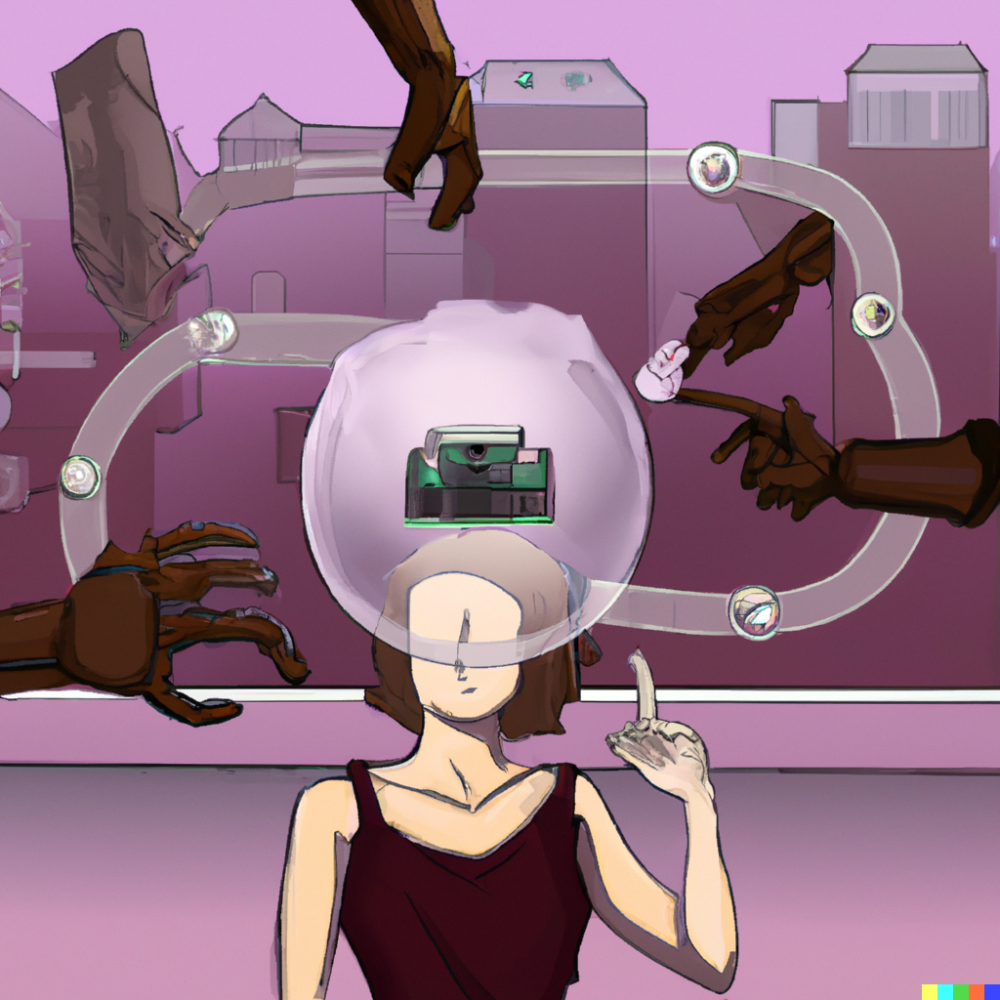

---

<!-- DALEE intput: Epic Ilustration of Artificial Intelligence -->

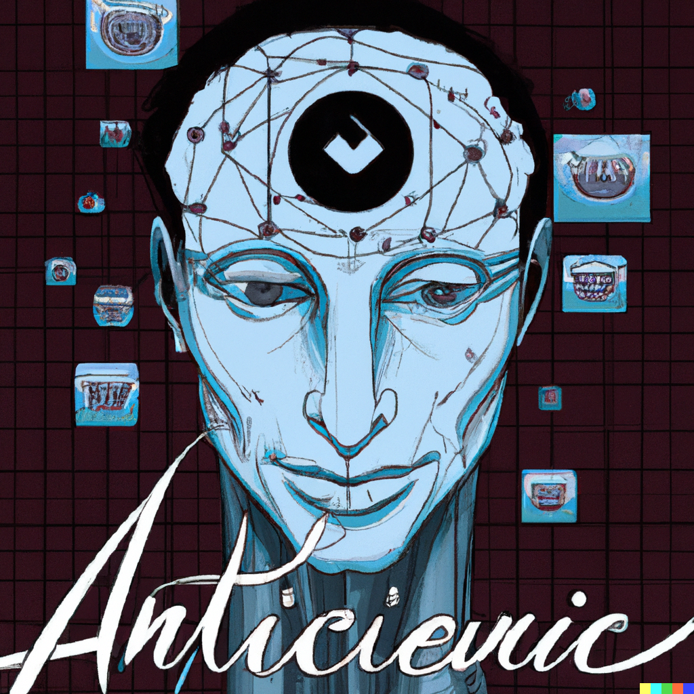

---

<!-- DALEE intput: Epic Ilustration of Artificial Intelligence -->

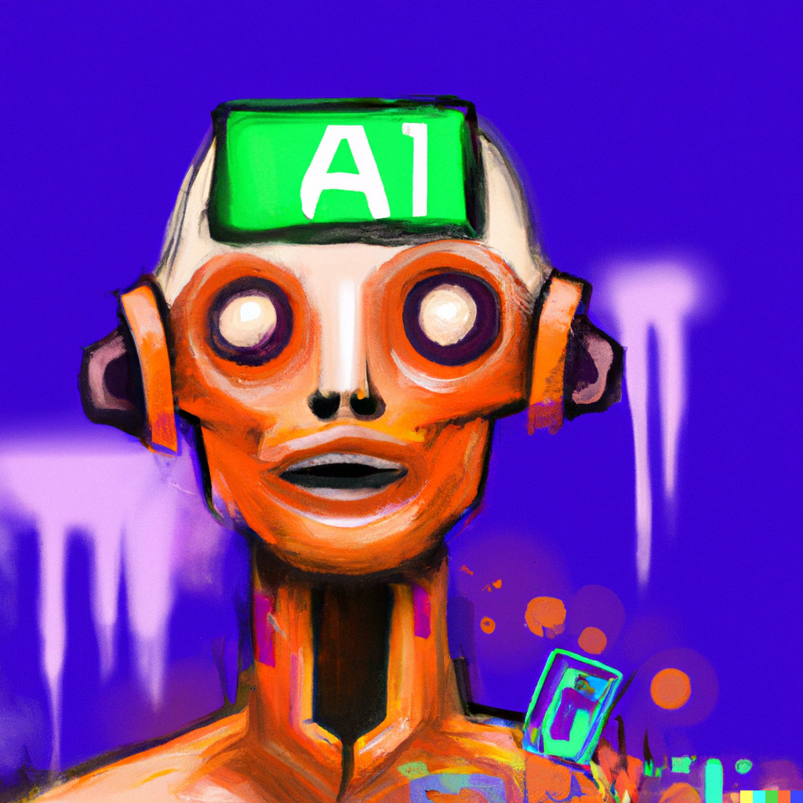

---

# Obsah

- moderní trendy v AI
- Azure a AI služby
- dema
  - Custom a Computer Vision
  - Speech Services
  - Machine Learning Studio

---

# Než začneme

- repozitář projetku [github.com/petrkucerak/AzureAI-Workshop](https://github.com/petrkucerak/AzureAI-Workshop)
- [Jak aktivovat Azure for Students](https://studuj.digital/2020/01/19/aktivace-azure-for-students/)
- pravidla

---

# Oblasti

- finance, big data a predikce dat
- text2speech 
- zpracování obrazu
- třídění pošty, security, ...
- sumarizace textu, chatbots, ...

<!--
OBLASTI
- finance, datová analýza a predikce dat (burza, marketing, rozmístění zboží, ...) Machine Learning a datová analýza, realtime data
- text2speech - syntetizace zvuku
- zpracování obrazu (obličej, text, znaky, účtenky a&nbsp;faktury, ...)
- třídění pošty (SPAM), security
- sumarizace textu, chatbots, ... Rozklíčování záměru zprávy 
- předvídání poruch stroje

-->

---

# Ukázky
## [OpenAI](https://openai.com/)

- https://chat.openai.com/chat - jazykový model
- https://labs.openai.com/ - DALLE 2

## Development

- https://github.com/features/copilot
- https://www.tensorflow.org/

<!--

ChatGPT:
- Napiš kód pro otestování rychlosti přenosu paketů v jazyce C.
- Jaký má přínos hra člověče nezlob se pro děti v předškolním věku?

DALLE:
- a ship in the middle of a storm

-->
---

# Praxe
## Autonomní auta

- obraz
- data
- senzory, CAN bus
- legislativa

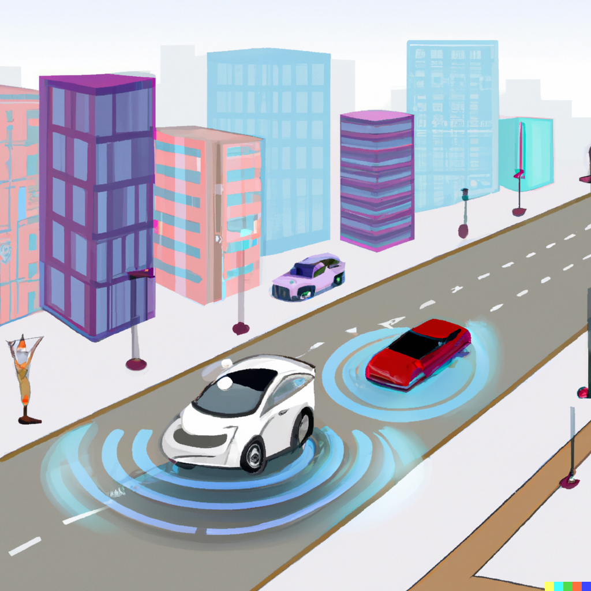

<!--
 
Představení osobně 2 nejbližších témat

MĚSTA V PILOTNÍM PROGRAMU

*Ruzne zdroje, ruzne nazory*

- North America
  - Phoenix, Arizona
  - Arlington, Texas
- Europe
  - Stockholm, Sweden
- Asia
  - Singapore
  - Hwaseong, South Korea

-->

---

# Praxe
## Autonomní drony

- distribuovaný systém
- [CTU FEL](https://fel.cvut.cz/cs)
- další doprava 

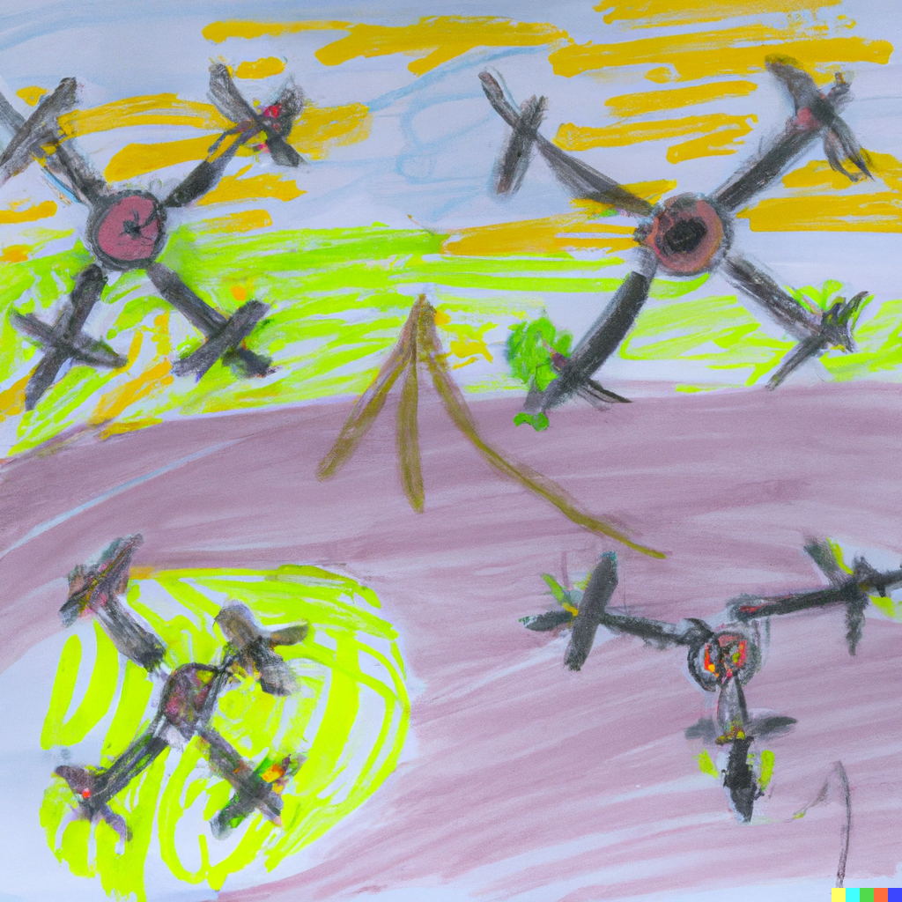

---

# Praxe
## Průmysl 4.0

IoT, 5G, AI

- sbírání
- data -> znalost
- závěr
- akce

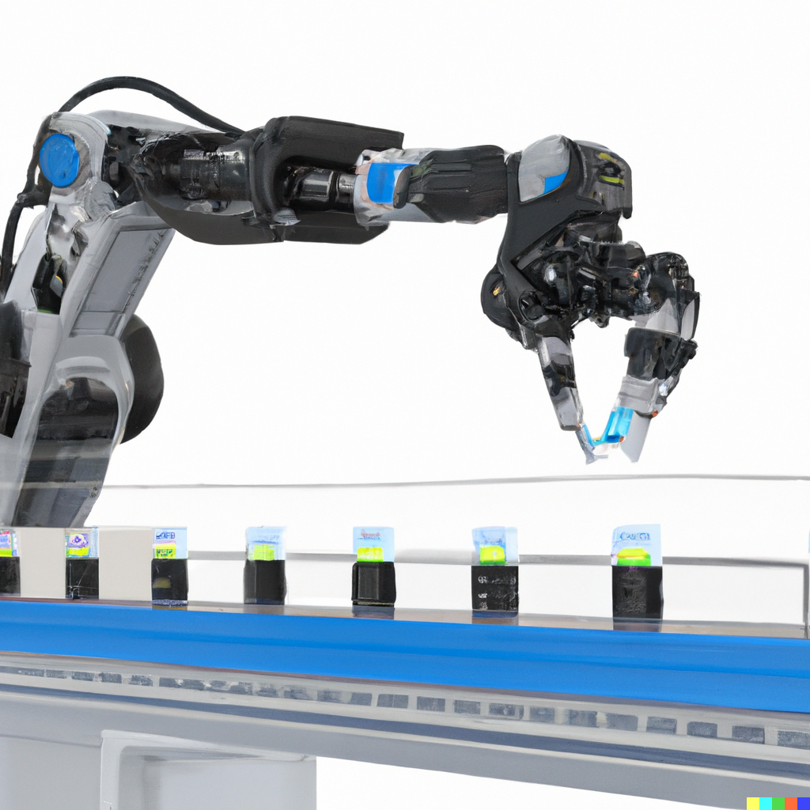

--- 

# Otázky a výzvy

- o čem nevíme, válečný rozvoj
- problematika výpočetní síly, *edge computing*
- datasety pro učení
- legislativa
- transformace pracovních pozic

<!-- 

OTÁZKY A VÝZVY, KTERÉ STOJÍ PŘED NÁMI

- O čem nevíme? Válka přispívá rozvoji, co přinese konflikt na ukrajině?
- Problematika výpočetního výkonu - edge computing
- Problematika data pro učení
- Problematika legislativy - nová osoba v EU
- Transformace pracovních pozic 
 
-->

---
<!-- Dalle inputMicrosoft Azure 3D ilustration -->

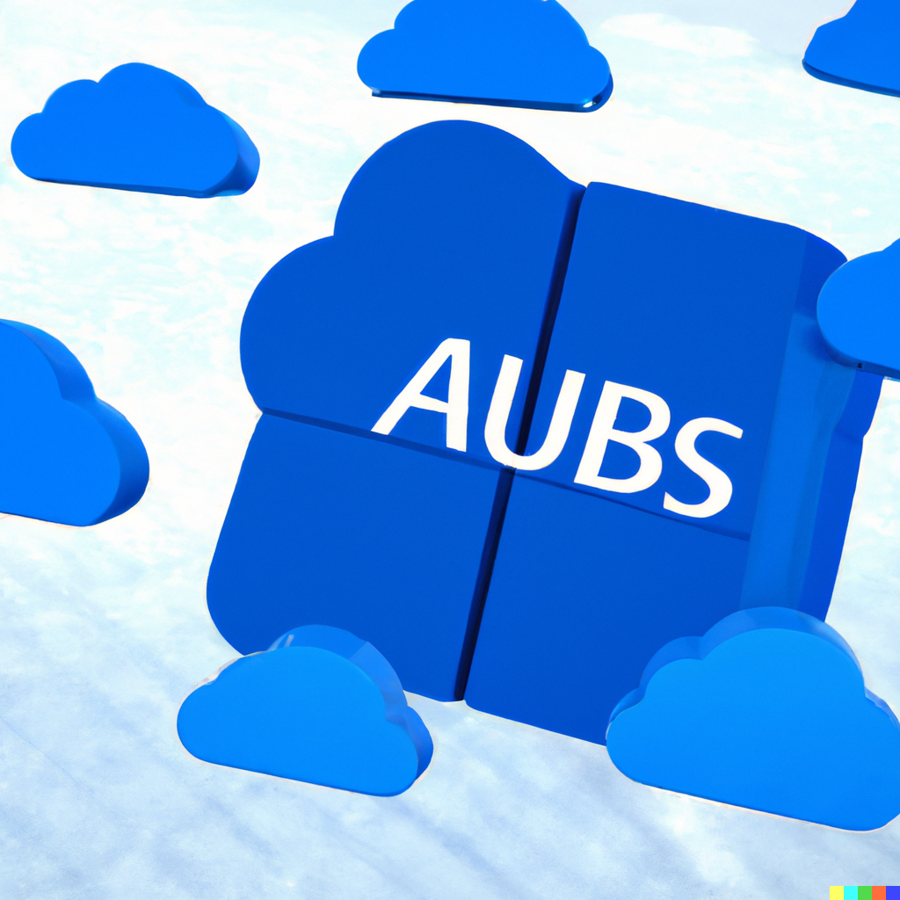

---

<!-- Druha část - Azure a AI služby -->

# Azure a AI

- [Azure Applied AI Services](https://azure.microsoft.com/en-us/products/applied-ai-services/#overview)
- [Azure Cognitive Services](https://azure.microsoft.com/en-us/products/cognitive-services/)
- [Azure Machine Learning](https://azure.microsoft.com/en-us/products/machine-learning/#product-overview)
- [AI infrastructure](https://www.microsoft.com/en-us/research/project/ai-at-scale/)

<!--
Na strankach MSFT o Azure AI, 4 kategorie

Otakzaaa?

- AI infrastructures
  - bezi na FPGAckach, kteras se prizpusobuji potrebam vypoctu

-->

---

# Azure Applied AI Services

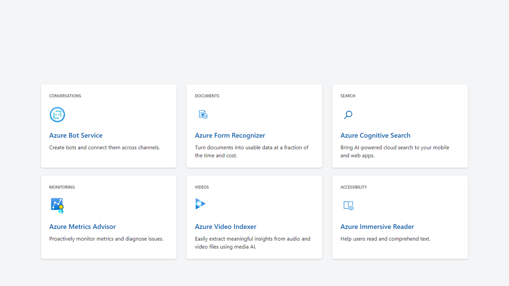

<!--
Azure Applied AI Services (aplikovane sluzby) 
  - Bot Services
  - Form Recognizer
  - Cognitive Search (AI cloud search)
  - Metrics Advisor (sledovani metrik a analyza incidentu)
  - Video Indexor (extrakce vyznamu z audia nebo videoa)
  - Immersive Reader

-->

---

# Azure Cognitive Services

- speech
- language
- vision
- decision
- OpenAI

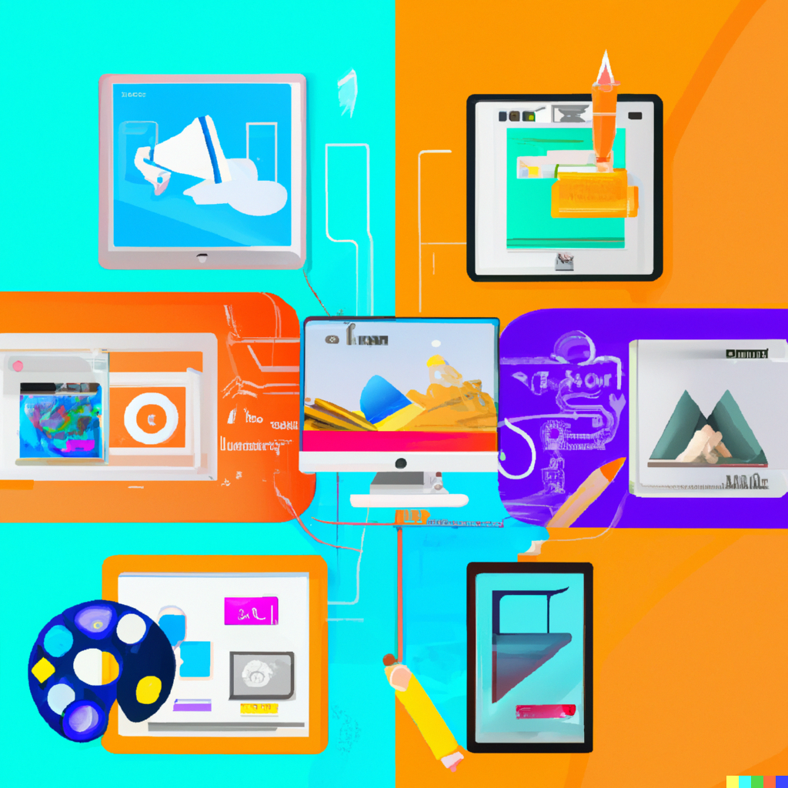

<!--

DALL-E input: digital art Congitive Services 

Azure Cognitive Services (jake mame smysly, ne doslova)
  - Speech (speech2text, text2speech, speech transaltion, speaker recognition)
  - Language (entity recognition, question answeing, translator, ...)
  - Vision (computer, custom fision, face API)
  - decision (anomaly detector, content moderator, personalizer)
  - Azure openAI Serivces (vyuziti jiz existujicich opensource modelu jako DALL-E 2, GPT-3, ...)
-->

---

# Azure Machine Learning

## Příprava dat

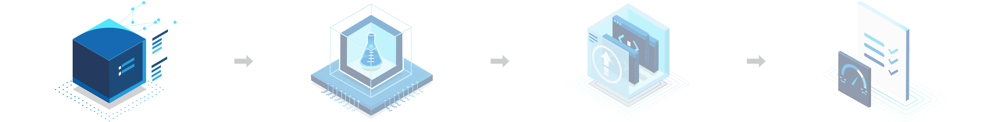

<!-- 
Azure Machine Learning
  - spracovani datasetu (oznaceni, uprava, kompletovani)
  - civceni a buildeni modelu
    - CLI, Python SDK
    - Notebooks
    - Automated
    - VS Code supports
    - Drag-and/Drop designer
    - Fraimeworks (TenserFlow, PyTorch, ...)
  - deploying a nasazeni do provozu
    - CI/CD pipelines
    - AI endpoins
    - optimalization
    - hybrid and multicloud
    - mode repository
    - prebuilt images
  - monitorovani a sprava
    - policies
    - security
    - error analytics
    - audits
-->
---
# Azure Machine Learning

## Trénování modelu

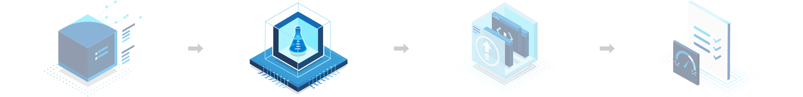

<!-- 
Azure Machine Learning
  - spracovani datasetu (oznaceni, uprava, kompletovani)
  - civceni a buildeni modelu
    - CLI, Python SDK
    - Notebooks
    - Automated
    - VS Code supports
    - Drag-and/Drop designer
    - Fraimeworks (TenserFlow, PyTorch, ...)
  - deploying a nasazeni do provozu
    - CI/CD pipelines
    - AI endpoins
    - optimalization
    - hybrid and multicloud
    - mode repository
    - prebuilt images
  - monitorovani a sprava
    - policies
    - security
    - error analytics
    - audits
-->
---
# Azure Machine Learning

## Validování a nasazení

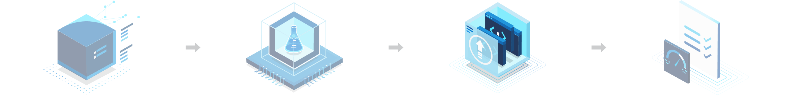

<!-- 
Azure Machine Learning
  - spracovani datasetu (oznaceni, uprava, kompletovani)
  - civceni a buildeni modelu
    - CLI, Python SDK
    - Notebooks
    - Automated
    - VS Code supports
    - Drag-and/Drop designer
    - Fraimeworks (TenserFlow, PyTorch, ...)
  - deploying a nasazeni do provozu
    - CI/CD pipelines
    - AI endpoins
    - optimalization
    - hybrid and multicloud
    - mode repository
    - prebuilt images
  - monitorovani a sprava
    - policies
    - security
    - error analytics
    - audits
-->
---
# Azure Machine Learning

## Monitorování a správa

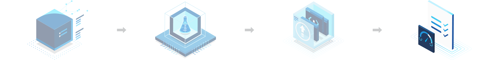

<!-- 
Azure Machine Learning
  - spracovani datasetu (oznaceni, uprava, kompletovani)
  - civceni a buildeni modelu
    - CLI, Python SDK
    - Notebooks
    - Automated
    - VS Code supports
    - Drag-and/Drop designer
    - Fraimeworks (TenserFlow, PyTorch, ...)
  - deploying a nasazeni do provozu
    - CI/CD pipelines
    - AI endpoins
    - optimalization
    - hybrid and multicloud
    - mode repository
    - prebuilt images
  - monitorovani a sprava
    - policies
    - security
    - error analytics
    - audits
-->

---

# DEMA

- Visions
  - Computer vision
  - Custom vision
- MLS
- Text2Speech

<!-- Jaka temata demicek nas cekaji? -->

---

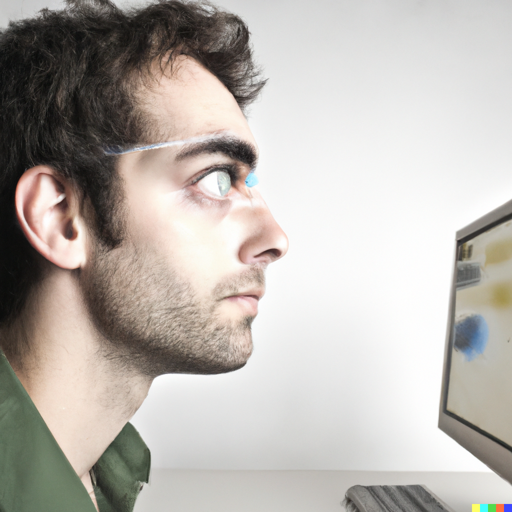